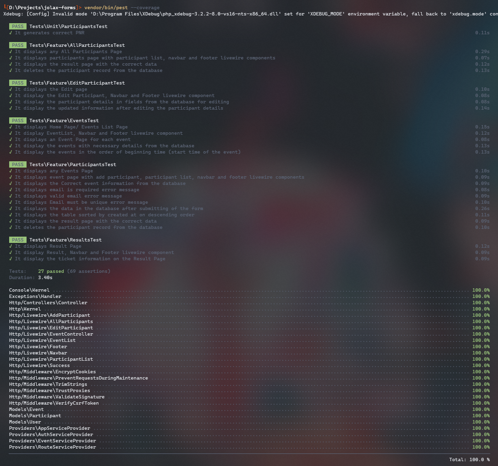

<!-- PROJECT LOGO -->
<br />
<div align="center">
  <a href="https://github.com/github_username/repo_name">
    
  </a>

  <p align="center">
    Built with ❤️

[](https://forthebadge.com)
[](https://forthebadge.com)
[](https://forthebadge.com)

</div>

# About The Project

## Code Coverage

[](https://codecov.io/gh/sahrohit/event-management)



## Installation

To install Event Maangement (Takshak) locally, follow these steps:

1. Clone the repository from GitHub:

    ```bash
    git clone https://github.com/sahrohit/event-management.git
    cd event-management
    ```

2. Install the required dependencies using Composer:

    ```bash
    composer install
    ```

3. Set up the environment file:

    ```bash
    cp .env.example .env
    ```

4. Create the database and set its credentials in the `.env` file.

5. . Run the migrations and seed the database:

    ```bash
    php artisan migrate --seed
    ```

6. Start the development server:

    ```bash
    php artisan serve
    ```

7. Start Vite development server:

    ```bash
    npm run dev
    ```

## Pages

| Pages         | Description                                                                |
| ------------- | -------------------------------------------------------------------------- |
| /             | Displays all the events in the database                                    |
| /{event_id}   | Display Add Participants Form with Participants Table for a specific event |
| /participants | Display all the participants                                               |

## Built With

<div style="display: flex; flex-wrap: wrap; gap:6px;">


</div>

## Contributing

Contributions are what make the open source community such an amazing place to learn, inspire, and create. Any contributions you make are **greatly appreciated**.

If you have a suggestion that would make this better, please fork the repo and create a pull request. You can also simply open an issue with the tag "enhancement".
Don't forget to give the project a star! Thanks again!

1. Fork the Project
2. Create your Feature Branch (`git checkout -b feature/AmazingFeature`)
3. Commit your Changes (`git commit -m 'Add some AmazingFeature'`)
4. Push to the Branch (`git push origin feature/AmazingFeature`)
5. Open a Pull Request

## Built by

<a href="https://github.com/sahrohit/event-management/graphs/contributors">
  
</a>

<!-- LICENSE -->

## License

Distributed under the MIT License. See `LICENSE.txt` for more information.
